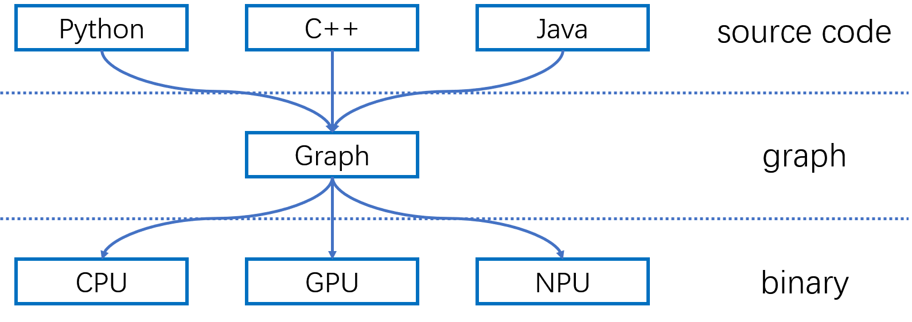

# The Rationale of Amanda

Amanda is a computation graph instrumentation framework for neural networks.
To explain our motivation to propose Amanda, let's briefly introduce some background and terminologies first.

## What is instrumentation?

Instrumentation is a technique to insert extra code into an existed program[1](#pin), usually for:

- **Program analysis** like performance profiling, code tracing, code coverage and debugging
- **Simulation/Emulation** for processor or cache

There are two instrumentation approaches:

- **Source code instrumentation** that instruments source code
- **Binary instrumentation** that instruments binary executable, which can be further classified into:
    - **Static instrumentation** that instruments the binary executable before execution and generates a persistent modified binary executable
    - **Dynamic instrumentation** that instruments the binary executable during execution without making any persistent modifications to the binary executable

## What is instrumentation for neural networks?

Using instrumentation, we can also insert code into an existed neural network, usually for:

- **Program Analysis** like performance profiling, dataflow analysis and debugging
- **(Computation) Graph partition** for distributed training or secure computation (protects critical model components)
- **Neural Architecture Search (NAS)** that adjusts a model's architecture during searching
- **Quantization** to replace some operations in a neural network to its quantized version
- **Pruning** for weight/activation masking

Let's briefly introduce some examples to better understand the application scenarios of instrumentation for neural network:

- **Debugging**: In this case, we want to insert code into a neural network to dump all the intermediate results of every operation.
- **Quantization**: In this case, we want to replace every Conv operations with its quantized version in a trained model, and then convert the model to another model format for serving.
- **Effective path extraction[2](#path)**: In this case, we want to extract a critical subset of neurons, synapses, and weights in the neural network that contributes most to the predicted class's output, which is called effective path. To extract effective path, we need to dump all the intermediate results during the inference, and then reconstruct the paths by back-propagation. During reconstruction, we apply the corresponding extraction op of each op to the output neurons in effective path the get the critical input neurons, synapses and weights in the current layer. Since different frameworks share the same extraction strategy, we want to use the same instrumentation code for multiple frameworks.

The examples above show three typical scenarios that the complexity is proportional to the number of involved frameworks (or ecosystems, we use them interchangeably):

- **Instrument in a single ecosystem (no-mapping case)**. A simple example is debugging a model on a single framework.
- **Instrument in one ecosystem, apply to another ecosystem (one-to-one case)**. In this case, we write instrumentation code for an ecosystem, and convert the modified graph to another ecosystem's graph format. The corresponding example is quantization.
- **Instrument once, apply to multiple ecosystems (one-to-many case)**. To achieve the goal of applying to multiple ecosystems, we need to build a common operation set across all the supported ecosystems, and verify that no operation in the graph is out of this common set. Graph partition in our examples has to deal with this level of complexity.

There are three instrumentation approaches:

- **Source code instrumentation** that instruments source code of the neural network.
- **(Computation) graph instrumentation** that instruments the computation graph. The computation graph is the intermediate representation of the neural network. Some DL frameworks expose them to be directly manipulated by users.
- **Binary instrumentation** that instruments the compiled binary or the execution engine.

## The current approaches: What's missing?

Although not designed specially for instrumentation, there are many existed works that provides some sort of instrumentation tools for neural networks:

- For no-mapping case:
    - Source code instrumentation
        - **PyTorch Module Hooks** are PyTorch's built-in tools to modify the forward and backward passes. We can add code before / after every op executes.
        - **MXNet Block Hooks** are MXNet's built-in tools to modify the graph. It is similar to PyTorch module hooks except that it only works in the forward pass.
    - Graph instrumentation
        - **TensorFlow Session Hooks** are TensorFlow's built-in tools to modify graph during the lifecycle of the session. Using session hooks, we can add op to the graph before finalized graph and observe the output value of arbitrary ops.
        - **Grappler** is TensorFlow's internal graph rewriting tool, which is used to develop compilation passes in TensorFlow's compiler.
    - Binary instrumentation
        - **TFLite Profiler** is TFLite's built-in profiler. It can provide runtime information for a serving model, including execution time and GPU memory usage. There are few binary instrumentation tools for neural network, TFLite Profiler is not an instrumentation tool but has a similar design with a binary instrumentation tool.
- For one-to-many case:
    - **MMdnn** is an model conversion framework that supports many frameworks, each of which has its own graph format. It avoids the engineering complexity of implementing a separate converter for each pair of two frameworks by introducing a common IR.
    - **ONNX** is an open computation graph exchange format supported by many DL frameworks. It proposes a common IR that other DL frameworks can convert their training graph to. Some instrumentation tools are provided out of box, including graph validation, graph optimization and shape inference.

None of the tools above can fully satisfy the requirements of the three scenarios (see the table below):

- For tools that only support no-mapping case, they cannot support quantization and effective path extraction, which need to apply to other ecosystems after instrumentation.
- For tools that support one-to-many case, they cannot support all ops in a single framework, thus cannot dump outputs for all kinds of ops in the scenario of debugging. Even in the case of quantization and effective path extraction, they can only support a subset of ops (thus "partly" in the table).

| Scenarios                                    | PyTorch Module Hooks | MXNet Block Hooks | TensorFlow Session Hooks | Grappler | TFLite Profiler | MMdnn  |  ONNX  |
| -------------------------------------------- | :------------------: | :---------------: | :----------------------: | :------: | :-------------: | :----: | :----: |
| Debugging (no-mapping case)                  |          Y           |         Y         |            Y             |    Y     |        N        |   N    |   N    |
| Quantization (one-to-one case)               |          N           |         N         |            N             |    N     |        N        | Partly | Partly |
| Effective Path Extraction (one-to-many case) |          N           |         N         |            N             |    N     |        N        | Partly | Partly |

To support all the three scenarios mentioned above, some requested features in a instrumentation framework are listed below:

| Features                              |  PyTorch Module Hooks   |    MXNet Block Hooks     | TensorFlow Session Hooks | Grappler | TFLite Profiler | MMdnn | ONNX |
| ------------------------------------- | :---------------------: | :----------------------: | :----------------------: | :------: | :-------------: | :---: | :--: |
| Available for training                |            Y            |            Y             |            Y             |    Y     |        N        |   N   |  N   |
| Available for serving                 |            N            |            N             |            N             |    N     |        Y        |   Y   |  Y   |
| Public instrumentation APIs           |            Y            |            Y             |            Y             |    N     |        N        |   N   |  N   |
| Insert ops                            |            Y            |            Y             |            Y             |    Y     |        N        |   Y   |  Y   |
| Remove ops                            |            N            |            N             |            N             |    Y     |        N        |   Y   |  Y   |
| Insert ops (backward pass)            |            Y            |            N             |            Y             |    Y     |        N        |   N   |  N   |
| Remove ops (backward pass)            |            N            |            N             |            N             |    Y     |        N        |   N   |  N   |
| Traverse graph                        |            N            |            N             |            Y             |    Y     |        N        |   Y   |  Y   |
| Support all ops in a single framework | N[*](#note1) | N[**](#note2) |            Y             |    Y     |        Y        |   N   |  N   |
| Support multiple frameworks           |            N            |            N             |            N             |    N     |        N        |   Y   |  Y   |

<a id="note1">[*]</a> only for module APIs, ops created from low-level functional APIs are not supported.

<a id="note2">[**]</a> only for Gluon/Block APIs, ops created from Symbol/Module APIs are not supported.

It is obvious that the existed tools are not enough. It is necessary to design a new instrumentation tool that can support all the required features. But what does it look like?

## Our Design Rationale

We follow several design principles to meet all the requirements above, which also distinguish our approach from the existed approaches:

- A standalone tool

    Instead of mending the existed tools in each framework, it would be more user-friendly and flexible to support all these frameworks in one place:

    - User-friendly: Being a standalone tool can provide unified APIs for all frameworks, which lowers the learning curve of users
    - Flexible: Being a standalone tool also eases the support for new frameworks and instrumentation tools in the future.

- A graph instrumentation framework

    We choose graph instrumentation among three possible instrumentation approaches because graph, as a general abstraction, has low diversity and keeps enough high level semantics for our scenarios (see the table below):

    |                      | Source code |      Graph       | Binary  |
    | -------------------- | :---------: | :--------------: | :-----: |
    | Diversity            |    High     |       Low        |  High   |
    | Availability         |  Training   | Training+Serving | Serving |
    | High Level semantics |     All     |       Most       |  Least  |
    | Runtime information  |     No      |        No        |   Yes   |

    - **Diversity**: Every framework has multiple frontends (Python/C++) and backends (CPU/GPU/TPU), but each of them often has a single graph format. It's hard to provide a unified representation with the same semantics across multiple frontends (should unify the semantics of different languages) and backends (should unify the semantics of binaries in different ISAs). Choosing graph can avoid the diversity problem.

        

    - **Availability**: The serialized computation graph, which is an well-defined exchange format, acts as a bridge between the training stage and the serving stage. In the serving stage, source code is usually not available since most released models is in the graph format; In the training stage, binary for serving is not available since serving stage uses different execution engines with the training stage and the binary will be different. The graph is the only choose to support both two stages at the same time.
    - **High Level semantics**: High level semantics will lose gradually when going through the compilation pipeline. In the graph stage, all necessary semantics for all our scenarios is kept. Some source code information will lose, such as the function information and the source line number. However, most mainstream frameworks are steadily working to enrich the expressiveness of graph. For example, Both TensorFlow and PyTorch have record source line information in the graph.
    - **Runtime information**: Only binary instrumentation can access runtime information. For example, we need scheduling information for performance profiling, which can only be achieved by binary instrumentation. However, all our three targeted scenarios don't require runtime information, which eliminates the necessity to use binary instrumentation.

- A minimal abstraction

    We provide the minimum abstraction for graph instrumentation by removing some unnecessary strong assumption introduced by existed frameworks:

    - Closed operation set assumption: Existed tools like ONNX assume that the operation set is a closed set. This assumption introduces an unacceptable engineering complexity that we need to create a superset of all operations in all supported frameworks. In Amanda, we employ an open operation set instead.
    - Tensor format assumption: Existed tools assume that tensors are in a specific format. For example, only dense tensor or sparse tensor in DOK format is allowed in ONNX while only dense tensor is allowed in MMdnn. In Amanda, any tensor format is allowed as long as the shape is correct.
    - Required attribute assumption: Existed tools assume that some attributes are required. For example, name attribute is required in TensorFlow/MMdnn, but op in PyTorch Graph is anonymous, which breaks the assumption. In Amanda, any attribute of operation/graph is optional by default.

    Although removing these three strong assumptions, we get a minimum graph abstraction:

    - **Op** is a node that represents a certain computation. We can attach optional attributes to it.
    - **Tensor** is the value passed between ops, which is produced and owned by an op
    - **Graph** is the container of ops. We can attach optional attributes to it.

    Based on this minimum graph abstraction, we need a mapping mechanism to fill the gap between different frameworks. Each component of the mapping mechanism will replace one of the removed strong assumptions:

    - **Operation mapping** to convert between different kinds of ops (replace closed operation set assumption)
    - **Tensor mapping** to convert between different tensor formats (replace tensor format assumption)
    - **Attribute mapping** to convert between different attributes of different graphs/ops (replace required attribute assumption)

## Mapping Mechanism

**TODO**

## Q&A

- Q: How to deal with the eager execution mode (which is more and more popular in the mainstream frameworks)?

    A: Each framework has a JIT for the eager execution mode (TorchScript for PyTorch and AutoGraph for TensorFlow), we can extract the computation graph from the JIT to get an entrance for graph instrumentation.

<a id="pin">[1]</a> Pin: building customized program analysis tools with dynamic instrumentation, https://dl.acm.org/doi/10.1145/1064978.1065034 [↩](#pin_ref)

<a id="path">[2]</a> Adversarial Defense Through Network Profiling Based Path Extraction, http://openaccess.thecvf.com/content_CVPR_2019/html/Qiu_Adversarial_Defense_Through_Network_Profiling_Based_Path_Extraction_CVPR_2019_paper.html [↩](#path_ref)

